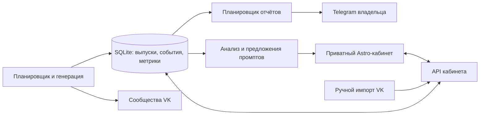

# Планы развития редакционного кабинета

Дата: 6 октября 2026. Статус: **планы, реализация ещё не начата**.
Это пять связанных фич для действующего автопостера:

1. [Недельный дашборд](01-weekly-dashboard.md) — что планируется, что опубликовано, где ошибки.
2. [Отчёты в Telegram до и после выпусков](02-telegram-reports.md) — состояние всей редакции утром и вечером.
3. [Импорт статистики, аналитика и улучшение промптов](03-analytics-and-prompt-improvement.md) — большой аналитический модуль с хранением содержимого постов за последние 30 дней.
4. [Редакционный цикл](04-editorial-cycle.md) — память публикаций, недельные предложения, рубрики и связанные серии для трёх VK-сообществ.
5. [Ограниченная автономность и эксперименты](05-autonomy-and-experiments.md) — бюджеты, границы действий, A/B-пилоты, остановка и откат.

## Текущая основа

Подтверждено чтением кода и конфигурации, а не новым production-аудитом:

| Уже есть                                                           | Чего пока нет                                                |
| ------------------------------------------------------------------ | ------------------------------------------------------------ |
| Три проекта в `bot/service.json`, собственные промпты и расписания | Реестр будущих выпусков и тематический план по слотам        |
| Состояния доставки в JSON, backoff, блокировки и `uncertain`       | Общая транзакционная база кабинета и отчётов                 |
| Посты, ID VK, модели и часть редакционных признаков в истории      | Обязательный снимок версии промпта для каждого выпуска       |
| Журнал ошибок, уведомления владельцу в Telegram                    | Сводные отчёты до/после утренней и вечерней серии            |
| `analytics.json`, расходы, ручной JSON-импорт через CLI            | Недельная загрузка VK-файлов через интерфейс                 |
| Удаление старых опубликованных GIF                                 | Сквозной TTL 30 дней для текстов, медиа, импортов и их копий |
| Статический Astro-сайт, отдельный контейнер бота на cloudru        | Приватный кабинет и серверный API для него                   |

Старый `bot/ROADMAP.md` описывает ранний этап и местами устарел; эти планы
опираются на текущие `service.json`, `core.mjs`, `metrics.mjs`, `logging.mjs`,
`maintenance.mjs`, `METRICS.md` и `deploy/POSTER.md`.

## Общая архитектура — предлагаемое решение

Приватный маршрут сайта: `https://dvzverev.ru/bot/`.
Если рабочий origin остаётся `www.dvzverev.ru`, apex перенаправляется на него
с сохранением `/bot/` и query-параметров. DNS и маршрут проверяются при реализации.

SQLite — запланированное локальное хранилище; сейчас бот продолжает работать
на JSON. Выбор Node/Python-адаптера — отдельный технический шаг с проверкой
поддержки в используемом runtime, транзакций и размера образа. До миграции
JSON остаётся единственным источником истины доставки: два независимых
писателя JSON/SQLite для одной доставки не допускаются.

API — отдельный процесс/контейнер в закрытой Docker-сети. Через общий origin
публикуется только `/bot/api/`; порт базы и прямой порт API наружу не открываются.
Публичный лендинг сохраняет static output и текущие бюджеты. Кабинет получает
отдельные ассеты и API, без SSR-миграции всего сайта.

SQLite работает на локальном диске с WAL, bounded busy-timeout и короткими
транзакциями; сетевые VK/LLM-запросы не удерживают DB-lock. Импорт и аналитические
расчёты идут через ограниченную очередь, чтение использует snapshot. Перед
реализацией установить профиль: новый API ≤ 128 MiB, один import/analysis job
одновременно; подтвердить замерами вместе с действующим poster и другими сервисами.
Отказ общего диска/БД останавливает новые внешние отправки, пока нельзя сохранить
их состояние. Продолжать отправку «ради доступности» без устойчивого подтверждения нельзя.

## Общие договорённости

- Идентификаторы: `project_id`, `edition_id`, `delivery_id`, `event_id`, `report_id`.
- Время хранится в UTC; оператор видит Europe/Moscow, неделю пн–вс.
- Выпуск — один редакционный материал; доставка — отправка одному получателю.
  Счётчики материалов и доставок всегда различаются.
- Будущая тема/бриф не выдаются за готовый текст; подготовленная генерация не
  считается публикацией. `sent` означает подтверждение API, а не ручную проверку рендера VK.
- Сбой: запись очищенного события, затем уведомление в Telegram. Недоступность
  кабинета/аналитики не меняет подтверждения доставок и не запускает повторы постов.
- Доступ только владельцу. Секреты VK/OpenRouter/Telegram не передаются браузеру.
- Полные тексты и медиа — TTL 30 дней. Компактные технические подтверждения
  без содержимого сохраняются отдельно ради защиты от повторов; подробности в плане 3.
- Ключи сообществ сохраняются единственным типом VK-авторизации. Недоступные
  охваты не заменяются нулями; источник подробных метрик — ручной импорт.
- «Файн-тюнинг» в этих планах — управляемое улучшение версий промптов и форматов,
  без обучения весов модели. Автоматическая публикация новой версии промпта не включается.

## Порядок реализации

| Этап                    | Результат                                                              | Зависимость                                                                                         |
| ----------------------- | ---------------------------------------------------------------------- | --------------------------------------------------------------------------------------------------- |
| 0. Общие данные         | Схема SQLite, миграция истории, единые состояния, снимки промптов, TTL | Основа всех четырёх фич                                                                             |
| 1. Кабинет              | Авторизация, недельный календарь, детали выпусков, ошибки              | Этап 0                                                                                              |
| 2. Отчёты               | Утро/вечер, до/после, таймаут серии, независимая очередь уведомлений   | Реестр и события этапа 0; может идти параллельно UI                                                 |
| 3. Статистика           | Импорт с предпросмотром и отменой, метрики каждого поста за 30 дней    | API и реестр                                                                                        |
| 4. Улучшение редакции   | Сегменты, версии промптов, рекомендации, контролируемые эксперименты   | Проверенная статистика и достаточное покрытие                                                       |
| 5. Редакционный цикл    | Недельные брифы, утверждение, серии и зависимости публикаций           | Память и календарь; редакционные preview доступны до импорта, оценка результатов — после этапов 3–4 |
| 6. Автономность и тесты | Лимиты, резервирование бюджета, варианты, остановка и rollback         | Реестр, импорт метрик и утверждённые редакционные правила                                           |

## Миграция и общий критерий готовности

- [ ] Снять защищённую резервную копию, остановить только poster и импортировать
      его JSON-историю, аналитику, стоимость и журнал с сохранением ID и статусов.
- [ ] Перед переключением сравнить число записей, адресатов, `sent`, `uncertain`,
      pending-задач и известные расходы. Ничего не отправлять во время миграции.
- [ ] Сделать SQLite единственным писателем состояния после проверки; прежние
      JSON-копии не использовать как параллельную активную очередь.
- [ ] Ограничить сроки backup-копий с текстами; при восстановлении очищать TTL
      до запуска отправок. Откат не восстанавливает старую очередь поверх новых доставок.
- [ ] На трёх проектах календарь, Telegram и аналитика используют одинаковые ID
      и правила счётчиков. Добавление четвёртого проекта требует конфигурации, не кода UI.
- [ ] Сохранить сценарии существующих тестов: crash/restart, backoff, неопределённая
      доставка, fallback моделей, GIF → текст. Проверить новые функции отдельными тестами.
- [ ] Измерить новые ресурсы на cloudru перед production-релизом; нагрузка кабинета
      и импорта не должна приводить к OOM бота или ухудшению остальных сервисов.

Каждый план ниже содержит свои этапы, проверки и Definition of Done.
