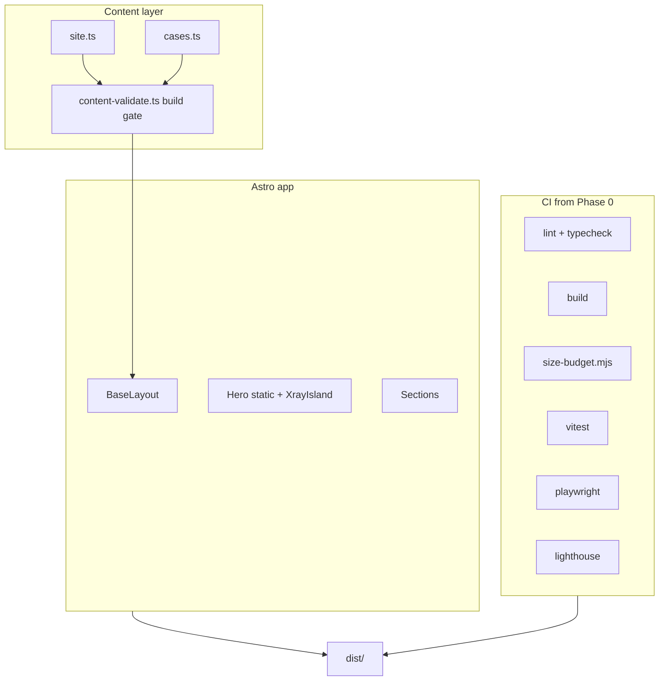
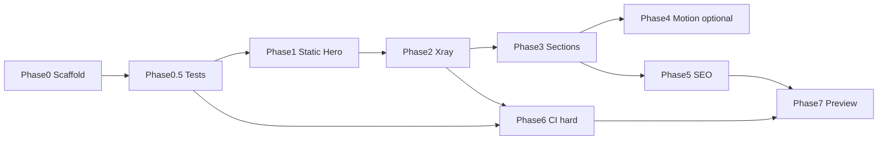

# План реализации лендинга (v2)

> Архивный план ранней X-ray-концепции. Текущая реализованная версия и решения описаны в [landing-plan.md](./landing-plan.md) и [creative-direction.md](./creative-direction.md).

Статус: рабочий план после code review v1  
Связанные документы: [creative-direction.md](./creative-direction.md), [landing-plan.md](./landing-plan.md), [content-inventory.md](./content-inventory.md), [performance-budget.md](./performance-budget.md), [deployment-target.md](./deployment-target.md)

## Принципы

1. **Poster-first** — hero полезен без JS до любого motion.
2. **Gates раньше объёма** — CI и тесты с Фазы 0, не в конце.
3. **Контент не врёт** — неподтверждённые факты не попадают на страницу; `[TBD]` только в `content/` исходниках, не в HTML.
4. **Один источник правды** — `src/content/site.ts` для имён, CTA, nav; creative-direction побеждает landing-plan по визуалу.

---

## Стек и границы

| Слой       | Решение                                                |
| ---------- | ------------------------------------------------------ |
| SSG        | Astro static, TypeScript strict                        |
| Стили      | CSS variables + CSS Modules                            |
| Интерактив | Нативный TS islands (`client:idle` / `client:visible`) |
| Пакеты     | pnpm, Node 22 LTS (`.nvmrc`)                           |
| Тесты      | Vitest (unit), Playwright (e2e), axe, Lighthouse CI    |
| Production | Только `dist/` на VPS; без Node/API на сервере         |

**Вне скоупа v1:** React runtime, GSAP, формы, аналитика, CMS, content-bot.

---

## Архитектура



### Структура `src/`

```
src/
  layouts/BaseLayout.astro
  pages/index.astro
  pages/404.astro
  components/
    site/Header.astro
    hero/Hero.astro
    hero/XrayIsland.astro
    sections/...
  styles/tokens.css, global.css, critical-hero.css
  scripts/
    xray-controller.ts      # pointer, toggle, reduced-motion branch
    xray-motion.ts            # lazy: WAAPI, strokes (phase 2 motion)
    xray-math.ts              # pure: lag, clamp, lens path — unit-tested
  content/
    site.ts
    cases.ts
    schema.ts                 # Zod schemas
    validate.ts               # fails build if invalid / TBD in publishable fields
  assets/fonts/, assets/svg/
scripts/                      # repo root tooling
  size-budget.mjs
  precompress.mjs             # .br/.gz for CI + deploy
tests/
  unit/xray-math.test.ts
  e2e/smoke.spec.ts
  e2e/a11y.spec.ts
  e2e/no-js.spec.ts
public/robots.txt, favicon/
.github/workflows/ci.yml
```

---

## Фазы

### Фаза 0 — Scaffold + CI skeleton

**Deliverables**

- Astro project, `output: 'static'`, compress HTML
- tokens.css из creative-direction §5
- Zod schemas + `validate.ts`: build падает, если
  - пустой обязательный текст кейса;
  - строка содержит `[TBD]` в полях, помеченных `publishable`;
  - нет `telegramUrl`, `canonicalBase`
- `site.ts`: header `DZ / PRODUCT ENGINEER` (display) + полное имя в footer/about
- Font pipeline: self-hosted WOFF2 subsets; **проверить лицензию** Alumni Sans / Onest до коммита бинарников
- `.nvmrc` (22), ESLint, Prettier, `pnpm astro check`
- **CI v0**: `lint → typecheck → build → vitest` (пустой smoke ok)

**Gates**

- `pnpm build` green
- `pnpm test` green
- CI green on empty page

---

### Фаза 0.5 — Test harness (до hero JS)

**Deliverables**

- Playwright: `no-js.spec.ts` — CTA href, heading visible
- `size-budget.mjs` — меряет gzip **и** brotli после `precompress.mjs`
- Preview server в CI: `pnpm preview` + precompressed assets ИЛИ `sirv` с brotli

**Gates**

- E2E запускается локально и в CI
- Size script не падает на пустой сборке (baseline зафиксирован)

---

### Фаза 1 — Статичный hero (без JS)

**Deliverables**

- Header, hero copy, CTA `https://t.me/zverev_dmitry` с `rel="noopener noreferrer"`
- Surface + System SVG; System — `aria-hidden="true"` (декор в static mode)
- Статичная маска X-ray preview (фиксированная зона)
- Critical CSS ≤ 35 KB brotli
- Skip link, focus styles, `color-scheme: light`
- Mobile 320–390: без horizontal scroll

**Gates**

- `no-js.spec.ts` — pass
- Size: HTML+critical CSS ≤ 35 KB
- Lighthouse mobile (hero-only page): Perf ≥ 90, A11y ≥ 95
- Screenshot baseline: 1440 + 390 (Playwright `toHaveScreenshot` — optional soft gate)

---

### Фаза 2 — X-ray controller (spike gate)

**Deliverables**

- `xray-math.ts` + vitest: lag 60–90ms, bounds, coarse pointer simplify flag
- `xray-controller.ts`: rAF, CSS vars mask, toggle, Escape
- **A11y (обязательно):**
  - кнопка `Показать изнутри`: `aria-expanded`, `aria-controls`
  - full System: focus trap + `Escape` возврат фокуса на кнопку
  - `prefers-reduced-motion`: toggle Surface/System без lens follow
  - keyboard: Tab до CTA не перехватывается canvas/SVG
- Touch: drag + кнопка; `touch-action` на hero zone
- Status label: `surface` → `x-ray ready` (visually hidden или mono badge)
- Island: `client:idle`
- JS ≤ 12 KB brotli (phase 1), total ≤ 30 KB

**Gates**

- vitest: xray-math 100% branch coverage на pure functions
- Playwright: toggle, Escape, focus return, CTA still clickable during lens
- `emulateMedia({ reducedMotion: 'reduce' })` — no rAF loop
- Perf regression: INP ≤ 200ms (lab)
- JS disabled — zero regression vs Фаза 1
- Manual: Safari + Firefox smoke checklist (1 строка в PR template)

**Stop rule:** если FPS < 60 на Pixel-class device — упростить lens path, не поднимать бюджет.

---

### Фаза 3 — Секции (контент + layout)

**Deliverables**

- Scene 02–07 по landing-plan §4 / creative-direction §8
- Кейсы: только поля без `[TBD]`; незаполненное — опустить блок или `demo` label
- Scene 02 hover: **CSS highlight** маршрутов, не второй X-ray instance
- Case Theater: static Surface/System pair; interactive X-ray — Фаза 4
- Images: AVIF/WebP, dimensions, lazy below fold
- FAQ: `<details>` / accessible accordion
- Footer: Telegram, GitHub, email **только после явного approve в site.ts**

**Gates**

- content validate: zero TBD in publishable output
- Playwright paths: hero→CTA, nav→cases→CTA, FAQ, footer
- axe: 0 serious/critical
- Responsive: 320, 768, 1024, 1440
- Heading order audit
- Total lazy-load ≤ 700 KB

---

### Фаза 4 — Motion layer (optional polish)

**Deliverables**

- `xray-motion.ts` loaded via dynamic `import()` after idle or first interaction
- Case hold-to-xray, SVG stroke events
- `document.hidden` stops loops
- One-shot scanner CSS strip

**Gates**

- Lighthouse Perf still ≥ 90 (full page)
- reduced-motion: identical text content vs Фаза 3
- Total JS still ≤ 30 KB brotli

**Skip rule:** если бюджет или FPS fail — ship Фаза 3 без Фазы 4 (MVP ok per landing-plan §9).

---

### Фаза 5 — SEO + security headers contract

**Deliverables**

- OG/Twitter, canonical, sitemap, robots
- JSON-LD Person + ProfessionalService (без выдуманных rating/review)
- 404 page
- **CSP draft** согласованный с inline critical CSS (nonce или hash-per-build)
- `security-headers.md` — шаблон для Nginx/Caddy: CSP, HSTS, X-Content-Type-Options, Referrer-Policy

**Gates**

- Rich Results Test valid
- `curl -I` preview: security headers present on staging
- Link check: Telegram, GitHub, mailto

---

### Фаза 6 — CI hard gates (расширение v0)

**Jobs:** lint → typecheck → unit → build → precompress → size-budget → playwright → lighthouse (×3 median) → pnpm audit (moderate+)

- Lighthouse: block if Perf < 90 or A11y < 95
- Grep `dist/`: no `react`, `gsap` in client chunks
- PR template: manual Safari/iOS checkbox

---

### Фаза 7 — Preview + deploy prep

**Deliverables**

- Preview: **Cloudflare Pages** (brotli, preview URLs per PR)
- `deploy/release.sh`: atomic symlink swap per deployment-target.md
- Nginx/Caddy config from `security-headers.md`

**Gates**

- Full manual matrix (landing-plan §8 Этап 4)
- Slow 4G + 4× CPU
- Third-party requests = 0 before load
- All budgets green on preview URL (not localhost)

---

### Фаза 8 — Production

Только по команде «публикуем»: VPS audit → DNS → upload → HTTPS/HSTS → redirect chain.

---

## Порядок и зависимости



**Жёсткие стопы**

- Не начинать Фазу 3 до green Фазы 2
- Не публиковать preview до green Фазы 6 на full page
- Не выкладывать на VPS до Фазы 7 checklist

---

## Definition of Done

- 10 сек → понятны ≥2 услуги
- CTA: hero, post-cases, footer
- Работает без JS и без motion
- Lighthouse: Perf ≥ 90, A11y ≥ 95 (median of 3)
- Все size budgets green
- Нет `[TBD]` в HTML
- Нет неподтверждённых метрик
- Keyboard path эквивалентен X-ray toggle

---

## Code review v1 → v2 changelog

| Проблема v1                                         | Исправление v2                         |
| --------------------------------------------------- | -------------------------------------- |
| `[TBD]` мог попасть на сайт                         | Build-time Zod + publishable fields    |
| Playwright только в Фазе 2, CI в Фазе 6             | Фаза 0.5 harness, CI с Фазы 0          |
| Lighthouse только на hero, потом full page без gate | Re-run full page в Фазах 4 и 7         |
| X-ray a11y не специфицирован                        | aria-expanded, focus trap, keyboard    |
| CSP в конце                                         | CSP draft в Фазе 5, headers contract   |
| Brotli measurement неясна                           | precompress.mjs + CI preview           |
| Два имени в header без решения                      | DZ в header, полное имя в footer/about |
| Scene 02 X-ray не определён                         | CSS highlight only                     |
| Нет unit tests для lens math                        | xray-math.ts + vitest                  |
| Font license не упомянута                           | Gate до коммита woff2                  |
| Phase 4 обязательна                                 | Optional с skip rule                   |
